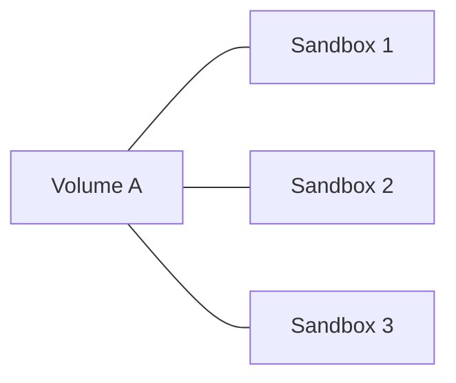
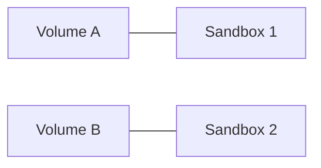

Volumes provide persistent storage that exists independently of sandbox lifecycles. Data written to a volume persists even after a sandbox is shut down, and volumes can be mounted to multiple sandboxes over time.

### One volume shared across multiple sandboxes



### Each sandbox with its own volume



With E2B SDK you can:
- [Read and write files to a volume.](/docs/volumes/read-write)
- [Get file and directory metadata.](/docs/volumes/info)
- [Upload data to a volume.](/docs/volumes/upload)
- [Download data from a volume.](/docs/volumes/download)

## Create a volume

<CodeGroup>
```js JavaScript & TypeScript
import { Volume } from 'e2b'

const volume = await Volume.create('my-volume')
console.log(volume.volumeId) // Volume ID
console.log(volume.name)     // 'my-volume'
```
```python Python
from e2b import Volume

volume = Volume.create('my-volume')
print(volume.volume_id)  # Volume ID
print(volume.name)       # 'my-volume'
```
</CodeGroup>

## Connect to an existing volume

You can connect to an existing volume by its ID using the `connect()` method.

<CodeGroup>
```js JavaScript & TypeScript
import { Volume } from 'e2b'

const volume = await Volume.connect('volume-id')
console.log(volume.volumeId) // Volume ID
console.log(volume.name)     // Volume name
```
```python Python
from e2b import Volume

volume = Volume.connect('volume-id')
print(volume.volume_id)  # Volume ID
print(volume.name)       # Volume name
```
</CodeGroup>

## Mount a volume to a sandbox

You can mount one or more volumes to a sandbox when creating it. The keys of the `volumeMounts` / `volume_mounts` object are the mount paths inside the sandbox.

<CodeGroup>
```js JavaScript & TypeScript
import { Volume, Sandbox } from 'e2b'

const volume = await Volume.create('my-volume')

const sandbox = await Sandbox.create({
  volumeMounts: {
    '/mnt/my-data': volume,
  },
})

// Files written to /mnt/my-data inside the sandbox are persisted in the volume
await sandbox.files.write('/mnt/my-data/hello.txt', 'Hello, world!')
```
```python Python
from e2b import Volume, Sandbox

volume = Volume.create('my-volume')

sandbox = Sandbox.create(
    volume_mounts={
        '/mnt/my-data': volume,
    },
)

# Files written to /mnt/my-data inside the sandbox are persisted in the volume
sandbox.files.write('/mnt/my-data/hello.txt', 'Hello, world!')
```
</CodeGroup>

## List volumes

<CodeGroup>
```js JavaScript & TypeScript
import { Volume } from 'e2b'

const volumes = await Volume.list()
console.log(volumes)
// [{ volumeId: '...', name: 'my-volume' }, ...]
```
```python Python
from e2b import Volume

volumes = Volume.list()
print(volumes)
# [VolumeInfo(volume_id='...', name='my-volume'), ...]
```
</CodeGroup>

## Get volume info

<CodeGroup>
```js JavaScript & TypeScript
import { Volume } from 'e2b'

const info = await Volume.getInfo('volume-id')
console.log(info)
// { volumeId: '...', name: 'my-volume' }
```
```python Python
from e2b import Volume

info = Volume.get_info('volume-id')
print(info)
# VolumeInfo(volume_id='...', name='my-volume')
```
</CodeGroup>

## Destroy a volume

<CodeGroup>
```js JavaScript & TypeScript
import { Volume } from 'e2b'

const success = await Volume.destroy('volume-id')
console.log(success) // true
```
```python Python
from e2b import Volume

success = Volume.destroy('volume-id')
print(success)  # True
```
</CodeGroup>
